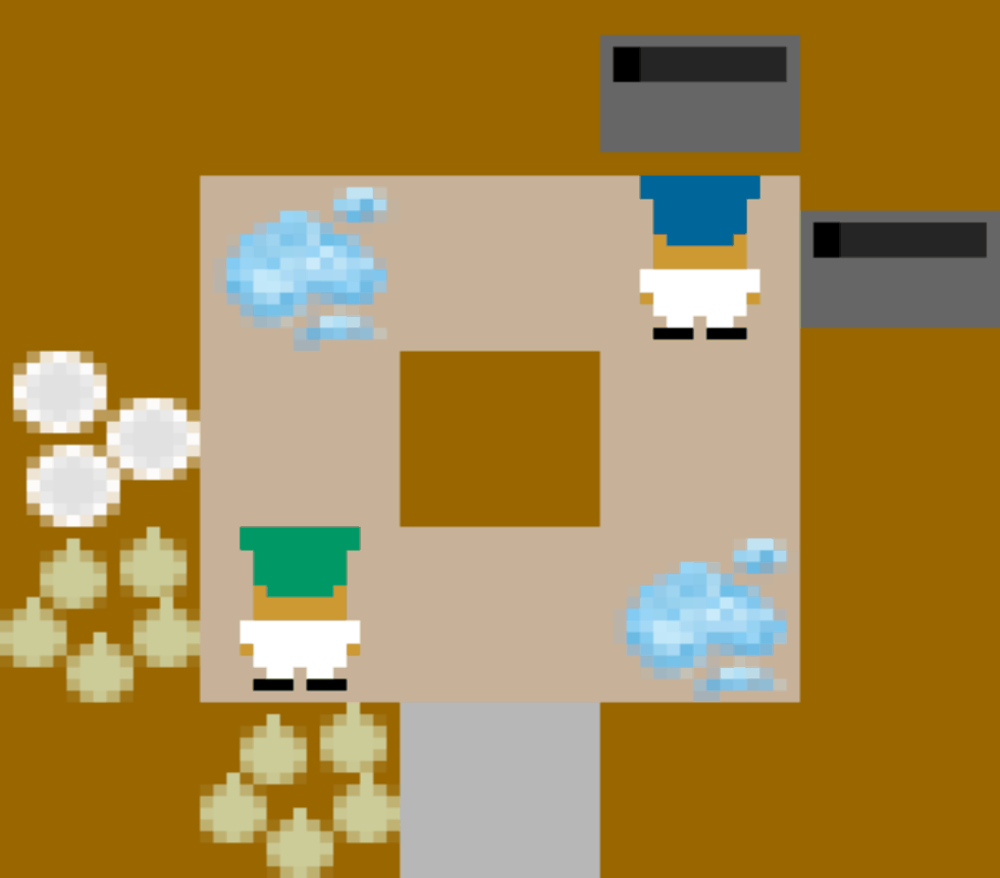
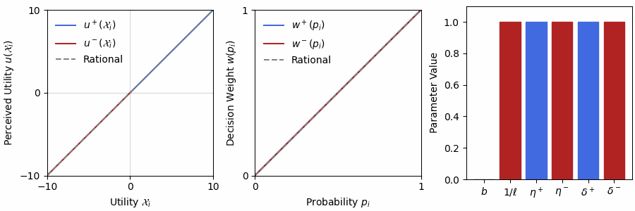

# Risky Overcooked
<p align="center">
   
  
  <i><br> Fig. Risk-sensitive strategies. Risk-averse agents (left) coordinate to avoid puddles while risk-seeking agents 
          (right) remain more independent by traversing puddles.</i>
</p>


## Introduction

This repository contains the implementation of the _Risky Overcooked_ environment, a modification of the [
_overcooked_ai_](https://github.com/HumanCompatibleAI/overcooked_ai) environment from [1].
Here, we provide a risky coordination task where agents must make and deliver onion soup as fast as possible.
This is done by placing 3 onions in the pot, waiting for the soup to cook, bringing a dish to the pot to pick up the
soup, and delivering the soup to the serving station.
Risk is explicitly incorporated into the environment by adding puddles in the way of the aforementioned subtasks.
When an agent enters a puddle with an object (e.g. dish, soup, or onion) it has a $p_{slip}$ chance of slipping and
losing the object.
Thus, agents must decide between:

- **Traverse the puddle:** resulting in either a shorter path when no slipping occurs or losing the object and having to
  retrieve another.
- **Detour around the puddle:** resulting in a longer path but ensuring the object is not lost.
- **Handoff object over a counter:** resulting in possible coordination costs to avoid puddles and long detours.

Provided in `src/risky_overcooked_rl/algorithms/DDQN` is the implementation of the multi-agent risk-sensitive
reinforcement learning (MARSRL) algorithm used to train risk-sensitive polices (see [DDQN/README.md](https://github.com/ASU-RISE-Lab/risky_overcooked/blob/master/src/risky_overcooked_rl/algorithms/DDQN/README.md) for more details).
This algorithm implements a Double Deep Q-Network (DDQN) modified with risk-sensitive objective based on Cumulative
Prospect Theory (CPT) [2].
We apply a level-k quantal response equilibrium (QRE) as a tractable alternative to Nash equilibrium policies.

<div align="center">
    
  <i><br> Fig. Prospect curves from CPT animation showing the risk-sensitive value of the action space for each agent in the
          _Risky Overcooked_ environment. In MARSRL, the all possible TD-targets, given stochastic state transitions,
          and their probabilities are passed through CPT to create a biased expectation of CPT-value over the TD-targets.
          <br>
  </i>
</div>

<br>

By enabling autonomous agents to learn these risk-sensitive strategies, we can generate adaptive behaviors when interacting
with biased humans by pre-training a space of candidate policies offline. This affords personalization to different humans
without the need for a data prior where human risk is present since we leverage a well-validated cognitive model (i.e., CPT).
During online interaction, Bayesian inference is performed to infer to and align with the partner's risk-sensitivity which
has been shown to promote effective coordination and trustworthy interactions [3]. We refer to this concept of reasoning
and adapting to partner's risk-sensitivity as _Risk-Sensitive Theory of Mind_ (RS-ToM) where the study in [4] shows main
results for adapting to an agent of unknown risk-sensitivity.

<div align="center">
    
  <i><br> Fig. State visitation frequency heatmaps of different risk-sensitive teams showing puddle avoidance or traversal in the Risky Coordination Ring (RCR) and Risky MultiPath (RMP) layouts [4].
  </i>
</div>


[//]: # (</p>)
<br>

<sub> _*The original version of this repository was released in (ICML 2025) [4].
It has since undergone minor modifications to improve the environment and algorithm implementations.
However, the original models and reproducible results can be found in `src/study_1/`._
</sub>

## Research Papers:

- [Smith, M. O. and Zhang, W. Risky Sensitive Theory of 
Mind: Coordinating with agents of Unknown Bias using Cumulative 
Prospect Theory," In _Proceedings of the International Conference 
on Machine Learning (ICML)_, 2025](https://openreview.net/forum?id=MRD19y4Zjm)

## Installation:
We currently offer only building from source.
1. Clone the repository:

```
git clone https://github.com/ASU-RISE-Lab/risky_overcooked.git
```

2. Install requirements 
```
pip install -r requirements.txt
```
This includes installation of pytorch. You may need to modify the `requirements.txt` file to match your system.

3. Verify the installation

```bash
python ./testing/package_test.py
```


## Repository Overview:

`risky_overcooked_py/` contains:

- `overcooked_mdp.py`: logic for handling state transitions and gaim assets
- `overcooked_env.py`: environment logic for simulating episodes
- `data/layouts/`: directory containing the layout files for the environment. Current implementation lists several
  layouts but only _risky_coordination_ring_ and _risky_multipath_ tasks are well validated at the moment.

`risky_overcooked_rl/` contains:

- `algorithms/DDQN/`: implementation of the MARSRL algorithm based on DDQN with CPT (see readme for more info)
    - `models/`: pretrained models for _risky_coordination_ring_ and _risky_multipath_ tasks.
    - `utils/`: utility functions for curriculum training, game theory, and agents/networks

- `utils/`: high-level utilities
    - `risk_sensitivity.py`: implementation of the CPT compiled with `numba.py` for speed
    - `state_utils.py`: implementation custom state and observation handlers
    - `visualization.py`: resources for generating static figures and chronographs
    - `rl_logger_V2.py`: dynamic logger to track online training and interface

`study_1/` contains:
    
- `models/`: pretrained models used in [4] (trained on earlier version of code)
- `results/`: raw results from [4] 
- `scripts/`: executable *.py scripts to generate results
  - `belief_test.py`: simulates Bayesian inference over risk-averse, risk-neutral, and risk-seeking partners
  - `policy_heatmap.py`: generates heatmap of risk-sensitive policies
  - `simulation_results.py`: generates data for table of results from [4]


---
## Cite this Work
```
@inproceedings{
  smith2025risksensitive,
  title={Risk-Sensitive Theory of Mind: Coordinating with Agents of Unknown Bias using Cumulative Prospect Theory},
  author={Mason O. Smith and Wenlong Zhang},
  booktitle={Forty-second International Conference on Machine Learning},
  year={2025},
  url={https://openreview.net/forum?id=MRD19y4Zjm}
}
```

## References
[1] Carroll, M., Shah, R., Ho, M. K., Griffiths, T., Seshia, S.,
Abbeel, P., and Dragan, A. On the utility of learning
about humans for human-ai coordination. In Advances in
Neural Information Processing Systems, pp. 5175–5186, 2019.

[2] Tversky, A. and Kahneman, D. Advances in prospect theory:
Cumulative representation of uncertainty. _Journal of Risk
and Uncertainty_, 5(4):297–323, 1992.

[3] [Smith, M. O. and Zhang, W. What if i’m wrong? team
performance and trustworthiness when modeling risk-
sensitivity in human–robot collaboration. _Transactions
on Human-Robot Interaction_, 14(2):1–30, 2025.](https://doi-org.ezproxy1.lib.asu.edu/10.1145/3706068)

[4] [Smith, M. O. and Zhang, W. Risky Sensitive Theory of 
Mind: Coordinating with agents of Unknown Bias using Cumulative 
Prospect Theory," In _Proceedings of the International Conference 
on Machine Learning (ICML)_, 2025](https://openreview.net/forum?id=MRD19y4Zjm)

## Questions and Comments

Please direct your questions and comments to Mason O. Smith at mosmith3@asu.edu


## Dev Log (Coming Soon)
- Working on PyPI installation
- Adding more algorithms including MADDPG
- Adding more layouts with pre-trained models soon
- Adding more robust tests to verify install
- Web application interface for interacting with humans
