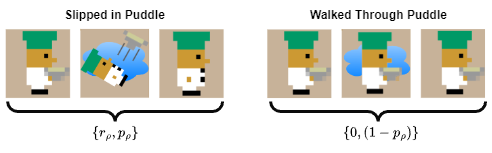

# Risky Overcooked
This repository contains the implementation of the _Risky Overcooked_ environment, a modification of the _overcooked_ai_ environment from _Carrol 2019_.


## Description
The standared _overcooked_ai_ environment implements a deterministic MDP.
The _Risky Overcooked_ environment adds a stochastic transition state that imposes a risk evaluation into agent decision-making.
The primary motivation for this modification is to investigate risk-sensitive reinforcement learning in a multi-agent setting.

---
## Installation
The current `setup.py` file references standard Overcooked library. Needs to be updated.
```bash
pip install numpy v-1.24.1
pip3 install torch torchvision torchaudio --index-url https://download.pytorch.org/whl/cu118

# tbd... ask mason for help if needed
```
---
Uses torch.compile which requires g++ compiler to be installed https://code.visualstudio.com/docs/cpp/config-mingw
## Usage

### Creating Custom Layouts
To create a custom layout, navigate to `risky_overcooked_py/data/layouts/` and create or modify `.layout` file.
The puddles can be added with the `W` character in the layout file. For example:
```
{
    "grid":  """XXPXX
                O   O
                XW WX
                X1 2X
                XDXSX""",
    "start_bonus_orders": [],
    "start_all_orders" : [
        { "ingredients" : ["onion", "onion", "onion"]}
    ],
    "rew_shaping_params": {
        "PLACEMENT_IN_POT_REW": 1,
        "DISH_PICKUP_REWARD": 1,
        "SOUP_PICKUP_REWARD": 3,
        "DISH_DISP_DISTANCE_REW": 1,
        "POT_DISTANCE_REW": 1,
        "SOUP_DISTANCE_REW": 1}
}
```
where the following keys in the grid are defined as:
- `X`: counter space
- `P`: pot
- `O`: onion ingredient dispenser
- `W`: puddle (risky state)
- `1`, `2`: player starting positions (can only have `1` if single player)
- `D`: dish dispenser
- `S`: serving station (deliver the soups)

The `rew_shaping_params` are the reward shaping parameters for the environment. 
These provide intermeidate rewards that should be decayed during training to compensate for sparse rewards in this environment. 
Currently, the MDP is using `old_dynamics=True` which requires three onions `["onion","onion","onion"]` and no bonus orders.

### Environment
Basic usage for simulating an episode can be found below.
For computational efficiency it is best to attempt to only generate one state encoding per iteration.
``` python
# Define the environment
LAYOUT = 'cramped_room'
HORIZON = 400

# Initialize the environment
mdp = OvercookedGridworld.from_layout_name(LAYOUT)
env = OvercookedEnv.from_mdp(mdp, horizon=HORIZON)

# Define the agents
agent1 = Agent1Class(...)
agent2 = Agent2Class(...)
agent_pair = AgentPairClass(agent1, agent2) # handles joint actions

# Simulate episopde
env.reset()
obs = agent_pair.featurize(state) # create state encoding
for t in itertools.count():
  joint_action, action_info = agent_pair.action(obs,...)
  next_state, reward, done, info = env.step(joint_action)
  if done: break
  obs = agent_pair.featurize(next_state) # create obs for next iteration
```
Full examples of training algorithms can be found in `src/risky_overcooked_rl/`.

### Visualization
```python

```

### Running Algorithms
```bash
python .\CirriculumLearning.py --cpt b=1 lam=1 eta_p=1 eta_n=1 delta_p=1 delta_n=1
python .\CirriculumLearning.py --cpt b=0 lam=1 eta_p=0.88 eta_n=0.88 delta_p=0.61 delta_n=0.69

```
---
## Risk-Sensitive Reinforcement Learning (RSRL)
Several risk-sensitive reinforcement learning algorithms were implemented in the Risky Overcooked environment.

### Double Deep Q-Network (DDQN) 
The DDQN algorithm was implemented in the Risky Overcooked environment.
Here the multi-layer perceptron (MLP) is implemented in `src/risky_overcooked_rl/utils/deep_models.py` 
where the `DQN_vector_feature()` class implements a Pytorch network.
Here, the NN takes the observation space (lossless state encoding vector) and outputs quality (q-value) 
of the action space (single agent |A|=6; multi-agent |A|=36). 
During training, both a policy and target network are spawned where a soft update of the target network is performed each step.
In the same directory, optimization/update functions, replay memory, and the soft update of the target network can be found.
The optimization function implements special methods to invert observation and action space when using self-play methods to update the same network under the ego-agent perspective.

### Soft Actor-Critic (SAC)

---
## Modification Log
Several modifications were made to the MDP (`overcooked_mdp.py >> OvercookedGridworld()` object) 

### Stochastic Transitions (Risky Puddles):
To implement the stochastic transition state (risky puddles) the following modifications were made to the MDP:
- added compliance to puddle tile `W` in `layout` 
- added `resolved_enter_water(...)` and implemented in `get_state_transition()` to handle stochastic transition (slip/not slip) when entering risky puddle state. Currently, has a `p_slip=0.5` chance of slipping in puddle and losing held object. Exiting puddle into a non-puddle state is determinstic.   
- added `get_water_locations()` to return the locations of the puddle tiles
- **(NOT_IMPLEMENTED)** added `get_possible_transitions(joint_action)` to return the possible transitions to next state and probability of each state given a joint action. Used for computing risk-sensitve expectations. 

### Custom Lossless State Encoding
Also, a custom state encoding was used.
We generally refer to this as `obs` where `state` is used to refer to the `OvercookedState` object. 
This is a vector encoding that creates a lossless representation of the state space. 
This encoding is used by the agents to interact with the environment and can be found in `overcooked_mdp.py >> OvercookedGridworld()` object.
- `get_lossless_encoding_vector_shape()` returns the shape of the lossless encoding vector
- `get_lossless_encoding_vector()` returns the lossless encoding vector of the current state
- an agent's `featurize()` method implements these MDP encodings
- vector encoding is dynamically computer and will be different size depending on the number of agents layout of the environment
```
player_features (9 x n_players,):
    pi_position (2,): position of player i {x,y}
    pi_orientation (4,): 1-hot encoding of orientation of player i 
    pi_objs (3,): 1-hot encoding of object held by player i {onion,dish,soup} 
world_features:
    counter_status (nc x 3,): 1-hot encoding of items on each counter {onion,dish,soup} with 'nc' counters
    pot_status (np,): for each 'np' counter, how many onions are in the pot (0-3; 4=done cooking)
```
This may be a bit computationallay intensive so best to call this once per step if possible and pass to necessary functions.
The standard Overcooked enviroment uses a mid-level planner which is incompatable with risk-sensitive RL as risk-sensitivity to puddles is maintained in the low-level (path) planning. 
However, the lossless mask encoding they used may be feasible but has been shown to be less tractable due to the addtional requirement of the CNN vision layer.
### Other modifications to the MDP
- The ```OvercookedGridworld.old_dynamics=True``` method was enabled
- Added ```state_manager``` to handle randomized start states external to MDP
  - Added `OvercookedGridworld.one_step_lookahead()` to return the next states given each joint action and their probabilities
### Agents
- Agents now use a losslsess vector encoding of the state space
  - base repository either uses a vector encoding (with losses) or a lossless mask encoding

---
## To Do
- When slipping in puddle, agent will lose `slipped_moves_lossed=2` moves (i.e. not be able to move for 2 tics) to incur risk when not holding object
- Improve state encoding to include pot cooking tic
- Change pot state to $20$ instead of $4$ when soup is done cooking.
- Agents only using one pot (randomize pot state?)